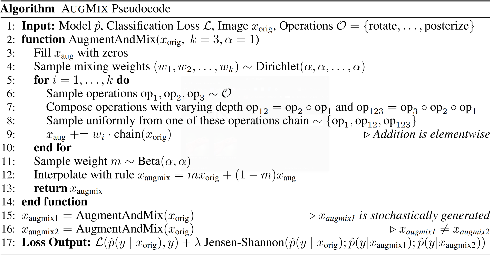

# AugMix - Refactored

This is a refactored version of the AugMix - Repository, to show some refactoring techniques for educational purposes. 
Also [poetry](https://python-poetry.org/) utils are added for package management 
as well es utilities to run the code on a GPU computing cluster.

Currently only the project is only tested with the cifar dataset.

Not all recommendations and guidelines are changed everywhere (as of limited time until now) so the project is needing further refactorings to become an optimal example.

## SETUP 
1. Setup poetry, first cd to the repo directory
```
poetry env use <path/to/python>
poetry shell
poetry install
```

2. Install [torch](https://pytorch.org/get-started/locally/) (can also use:)
```
pip install torch torchvision torchaudio --extra-index-url https://download.pytorch.org/whl/cu116
```

3. Install [tqdm](https://tqdm.github.io/)~(for progress bar) and [ipdb](https://wangchuan.github.io/coding/2017/07/12/ipdb-cheat-sheet.html)~(for debugging):
```
pip install tqdm
pip install ipdb
```

## Using [Hydra](https://hydra.cc/docs/intro/)
* [Hydra](https://hydra.cc/docs/intro/) is a framework that simplifies development.
* We did not include it in this package, however one can do so and then use cool commands instead of 'python cifar.py' etc and make the repository much more moduler.

## SLURM commands
1. Submitting a job to the OMNI cluster:

 a. create a bash file, example in job_scripts/different_networks.sh

 b. sbatch job_scripts/different_networks.sh


2. Monitoring submitted jobs:
 
 a. monitoring particular job : squeue -j job_id 

 b. monitoring all jobs by user: squeue -u user_id

 c. monitoring progress every second: watch -n 1 squeue -u user_id

 d. monitoring jobs on a partition : squeue -p gpu


3. Getting information about a job: scontrol show JOB=job_id


4. Re-arranging jobs by changing NICE:  scontrol update JOB=job_id NICE=integer.
   *  Higher number leads to less priority and lower number leads to higher priority. Default NICE=0


5. Finding out job efficiency: seff -j job_id


The original Readme starts below:


# AugMix


## Introduction

We propose AugMix, a data processing technique that mixes augmented images and
enforces consistent embeddings of the augmented images, which results in
increased robustness and improved uncertainty calibration. AugMix does not
require tuning to work correctly, as with random cropping or CutOut, and thus
enables plug-and-play data augmentation. AugMix significantly improves
robustness and uncertainty measures on challenging image classification
benchmarks, closing the gap between previous methods and the best possible
performance by more than half in some cases. With AugMix, we obtain
state-of-the-art on ImageNet-C, ImageNet-P and in uncertainty estimation when
the train and test distribution do not match.

For more details please see our [ICLR 2020 paper](https://arxiv.org/pdf/1912.02781.pdf).

## Pseudocode



## Contents

This directory includes a reference implementation in NumPy of the augmentation
method used in AugMix in `augment_and_mix.py`. The full AugMix method also adds
a Jensen-Shanon Divergence consistency loss to enforce consistent predictions
between two different augmentations of the input image and the clean image
itself.

We also include PyTorch re-implementations of AugMix on both CIFAR-10/100 and
ImageNet in `cifar.py` and `imagenet.py` respectively, which both support
training and evaluation on CIFAR-10/100-C and ImageNet-C.

## Requirements

*   numpy>=1.15.0
*   Pillow>=6.1.0
*   torch==1.2.0
*   torchvision==0.2.2

## Setup

1.  Install PyTorch and other required python libraries with:

    ```
    pip install -r requirements.txt
    ```

2.  Download CIFAR-10-C and CIFAR-100-C datasets with:

    ```
    mkdir -p ./data/cifar
    curl -O https://zenodo.org/record/2535967/files/CIFAR-10-C.tar
    curl -O https://zenodo.org/record/3555552/files/CIFAR-100-C.tar
    tar -xvf CIFAR-100-C.tar -C data/cifar/
    tar -xvf CIFAR-10-C.tar -C data/cifar/
    ```

3.  Download ImageNet-C with:

    ```
    mkdir -p ./data/imagenet/imagenet-c
    curl -O https://zenodo.org/record/2235448/files/blur.tar
    curl -O https://zenodo.org/record/2235448/files/digital.tar
    curl -O https://zenodo.org/record/2235448/files/noise.tar
    curl -O https://zenodo.org/record/2235448/files/weather.tar
    tar -xvf blur.tar -C data/imagenet/imagenet-c
    tar -xvf digital.tar -C data/imagenet/imagenet-c
    tar -xvf noise.tar -C data/imagenet/imagenet-c
    tar -xvf weather.tar -C data/imagenet/imagenet-c
    ```

## Usage

The Jensen-Shannon Divergence loss term may be disabled for faster training at the cost of slightly lower performance by adding the flag `--no-jsd`.

Training recipes used in our paper:

WRN: `python cifar.py`

AllConv: `python cifar.py -m allconv`

ResNeXt: `python cifar.py -m resnext -e 200`

DenseNet: `python cifar.py -m densenet -e 200 -wd 0.0001`

ResNet-50: `python imagenet.py <path/to/imagenet> <path/to/imagenet-c>`

## Pretrained weights

Weights for a ResNet-50 ImageNet classifier trained with AugMix for 180 epochs are available
[here](https://drive.google.com/file/d/1z-1V3rdFiwqSECz7Wkmn4VJVefJGJGiF/view?usp=sharing).

This model has a 65.3 mean Corruption Error (mCE) and a 77.53% top-1 accuracy on clean ImageNet data.

## Citation

If you find this useful for your work, please consider citing

```
@article{hendrycks2020augmix,
  title={{AugMix}: A Simple Data Processing Method to Improve Robustness and Uncertainty},
  author={Hendrycks, Dan and Mu, Norman and Cubuk, Ekin D. and Zoph, Barret and Gilmer, Justin and Lakshminarayanan, Balaji},
  journal={Proceedings of the International Conference on Learning Representations (ICLR)},
  year={2020}
}
```
